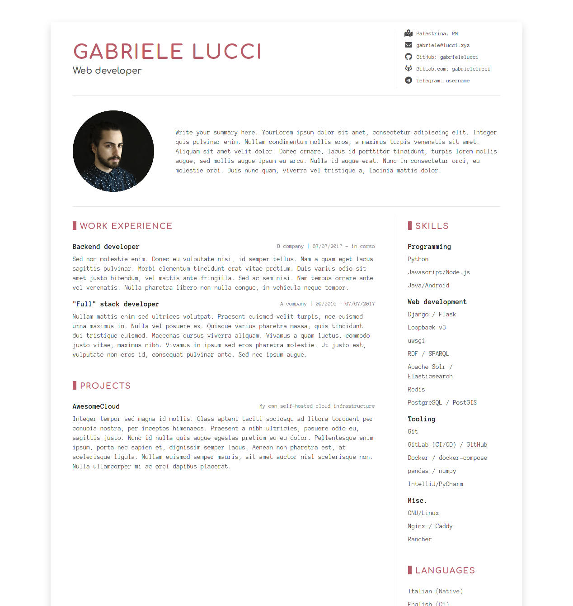

# Hugo DevResume Theme

This is a slight re-design of [DevResume](//github.com/xriley/DevResume-Theme) - a great looking resume/CV template 
designed for developers by Xiaoying Riley. 

This is based on [Jerry Kiely's Hugo port](//github.com/cowboysmall-tools/hugo-devresume-theme), 
with some tweaks to suit my needs.

## Screenshot

## Features

### Original

- Fully Responsive
- HTML5 + CSS3
- Built on Bootstrap 4
- 1000+ FontAwesome icons
- SCSS source files included
- Compatible with all modern browsers

### Changes

- Improved layout for small devices
- Fonts, using Anonymous Pro for paragraphs and Comfortaa for titles
- Everything is bundled and managed by npm

## Getting Started

## Installation

Within the root of your Hugo project execute the following:

    git clone https://github.com/cowboysmall-tools/hugo-devresume-theme.git themes/hugo-devresume-theme

### Setup

Pull Bootstrap and fonts using npm:

    npm install

Copy [`exampleSite/config.toml`]() to the root of your Hugo site:

    cp exampleSite/config.toml ../../config.toml 

Edit `config.toml` and add your relevant information.

You are good to go! You can preview your website with: 

    hugo server
    
Or you can generate your site wih:

    hugo

## License

Copyright (C) 2020 Gabriele Lucci

Licensed under [MIT](LICENSE) except where noted.
